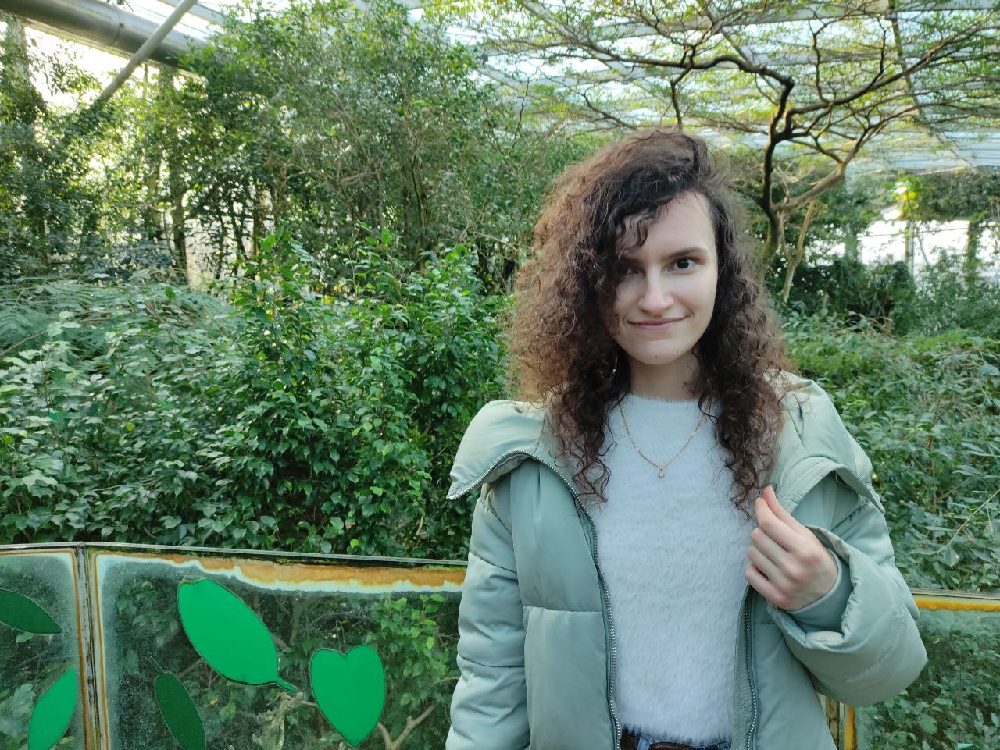
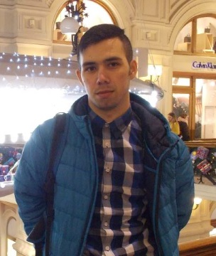
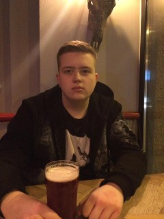

# **Bielená Vanessa**
## :bookmark:**Grafička**

Ahoj, volám sa Vanessa. Pochádzam zo Slovenska, z malebného mestečka menom Martin. Študujem Softwarové inžinierstvo na fakulte FEL. Medzi moje záľuby patrí makeup, vrhanie nožmi a rituálne obetovania detí démonom.

# **Dmytryienko Kateryna**
## :bookmark:**Projektový manažer**

Ahoj! Jmenuju se Kateryna Dmytryienko. Je mi 20 let, studuji FEL SIT. Baví mě programování a hlavně ráda plním úkoly, které nezvládám za první pokus, protože ukazuje mi to, čemu se musím ještě naučit a jak se mám dále rozvíjet. Volný čas trávím hlavně za vařením jídla a ve fitku, kam se snažím chodit aspoň jednou týdně. 

# **Kross Aleksandr**
## :bookmark:**Administrátor projektu**

### **O mně:**
Jmenuji se Aleksandr. Ale kamarádi mi říkají Alex. :relaxed: Mám rád Computer Science :computer: ​​a matematiku :books:. Jsem studentem 🆂🅸🆃 (nejlepší studijní program na FEL CVUT). Rád pracuji na týmových projektech. Ve volném čase se věnuji studiu cizích jazyků a rád cestuji :earth_africa:.

# **Kononenko Mikhailo**
## :bookmark:**Byznys analytik**

# **Andronov Nikita**
## :bookmark:**Vedoucí týmu**

Ahoj, jmenuji se Nikita, jsem studentem prvního ročníku SITu na FELu. Volný čas trávím hraním počítačových her a posloucháním hudby. Mám rád programování.